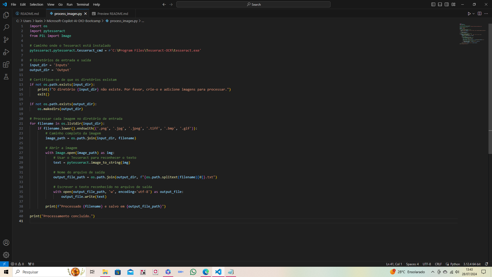
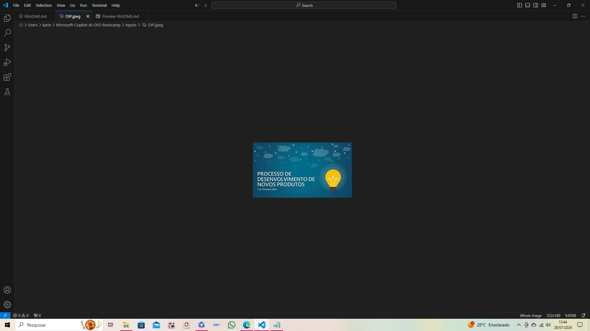
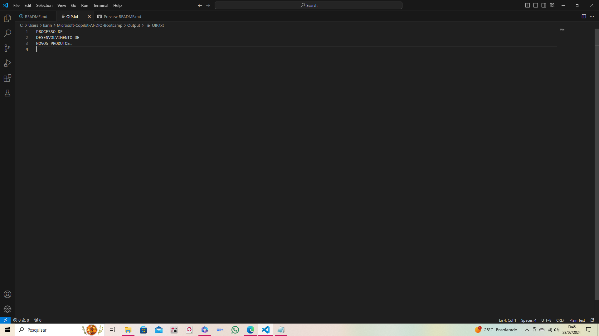

# Microsoft-Copilot-AI-DIO-Bootcamp 🎯

## Descrição do Projeto 📜

Este projeto foi desenvolvido como parte do desafio da plataforma [DIO](https://www.dio.me) para o bootcamp de IA com Microsoft Copilot. O objetivo é criar um repositório GitHub que demonstre o uso de OCR (Optical Character Recognition) utilizando a biblioteca Tesseract OCR e Python. O projeto processa imagens na pasta `Inputs` e salva os resultados na pasta `Output`.
<br>
<br>
## Estrutura do Projeto 🗂️

```plaintext
Microsoft-Copilot-AI-DIO-Bootcamp/
├── Inputs/             # Pasta contendo as imagens de entrada
├── Output/             # Pasta contendo os resultados do OCR
├── process_images.py   # Script Python que processa as imagens
└── README.md           # Arquivo de documentação do projeto
```
<br>

## Pré-requisitos 🛠️

Antes de começar, você precisará ter o seguinte software instalado em sua máquina:

- [Python 3.12](https://www.python.org/downloads/release/python-3120/)
- [Tesseract OCR](https://github.com/tesseract-ocr/tesseract)
- [Git](https://git-scm.com/)
<br>

## Configuração do Ambiente ⚙️

### Passo 1: Instalar Python e Tesseract OCR

1. **Instale o Python 3.12**:
   - Baixe e instale a versão mais recente do Python a partir do [site oficial](https://www.python.org/downloads/release/python-3120/).
   - Certifique-se de adicionar Python ao PATH durante a instalação.

2. **Instale o Tesseract OCR**:
   - Baixe e instale o Tesseract OCR a partir do [repositório oficial](https://github.com/tesseract-ocr/tesseract).

3. **Instale a Biblioteca `pytesseract`**:
   - Abra o terminal ou prompt de comando e execute:
     ```sh
     pip install pytesseract
     ```
<br>

### Passo 2: Clonar o Repositório

Clone este repositório para sua máquina local usando o comando:

```sh
git clone https://github.com/KarineMeireles/Microsoft-Copilot-AI-DIO-Bootcamp.git
```
<br>

### Passo 3: Estrutura de Pastas

Certifique-se de que as pastas `Inputs` e `Output` existem no diretório do projeto. Se não existirem, crie-as:

```sh
mkdir Inputs Output
```
<br>

### Passo 4: Adicionar Imagens 📸

Adicione as imagens que você deseja processar na pasta `Inputs`.
<br>
<br>
## Executar o Script 🚀

Para processar as imagens e obter os resultados de OCR, execute o script `process_images.py`:

```sh
python process_images.py
```

Os resultados serão salvos na pasta `Output`.
<br><br>

## Resultados 📝

Os resultados do OCR serão salvos em arquivos de texto na pasta `Output`, com o mesmo nome dos arquivos de imagem de entrada.
<br><br>

## Insights e Aprendizados 📚

Durante o desenvolvimento deste projeto, aprendi a:

- Configurar o ambiente Python para processamento de imagens.
- Utilizar a biblioteca Tesseract OCR para reconhecimento de texto em imagens.
- Gerenciar repositórios GitHub e documentar projetos para facilitar a reprodução e compreensão por outros desenvolvedores.

<br>

## Contribuição 🤝

Contribuições são bem-vindas! Se você tiver sugestões ou melhorias, por favor, envie um pull request ou abra uma issue.
<br>
<br>
## Licença 📄

Este projeto está licenciado sob a Licença MIT - veja o arquivo [LICENSE](LICENSE) para mais detalhes.


---
<br>

## Links Úteis 🔗

- [Branch Principal](https://github.com/KarineMeireles/Microsoft-Copilot-AI-DIO-Bootcamp/tree/main)

<br>

## Prints 📸




<br>




<br>


<br>

## Contato 📧

Karine Meireles - [karinelameireles@hotmail.com](mailto:karinelameireles@hotmail.com)